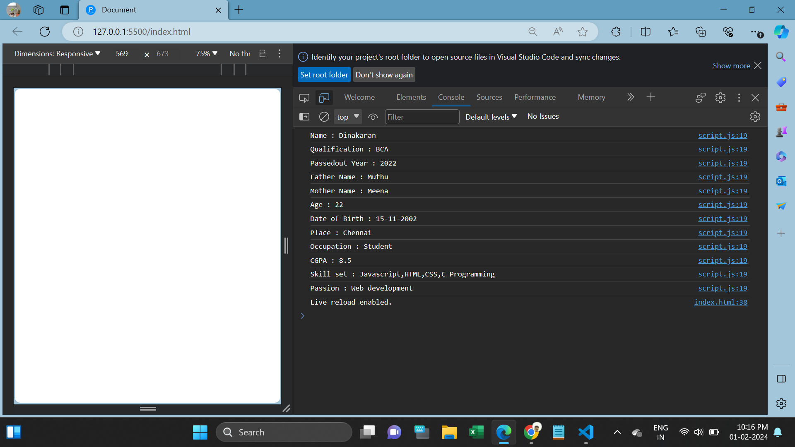
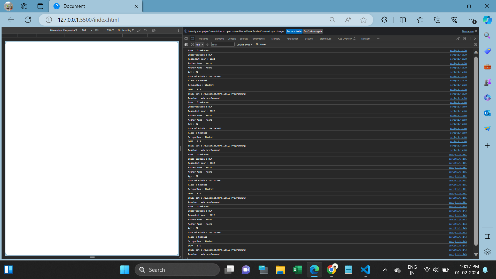

<h1>Array & Objects Task</h1>

1. Create your own resume data in JSON format. (script.js) 

2. For the above JSON, iterate over all for loops (for, for in, for of, forEach) (script1.js)

 

I have created JSON object in script.js file.

The JSON Objects iterated over using for, for in, foreach, for of loops.

<h2>JSON:</h2>

JSON (JavaScript Object Notation) is a lightweight data interchange format that is easy for humans to read and write, and easy for machines to parse and generate.

JSON represents data as key-value pairs, similar to object literals in JavaScript.

<h2>for loop:</h2>

The for loop is a general-purpose loop where you can specify the initialization, condition, and iteration steps explicitly.

<h2>forEach:</h2>

forEach is a method available on arrays in JavaScript. It is used for iterating over the elements of an array.

<h2>for...in loop:</h2>

The for...in loop is used to iterate over the enumerable properties of an object.

<h2>for...of loop:</h2>

The for...of loop is used for iterating over iterable objects (e.g., arrays, strings, maps, sets).

<h2>Screenshots</h2>

1. Script.js Result:

 

2. Script1.js Result:

